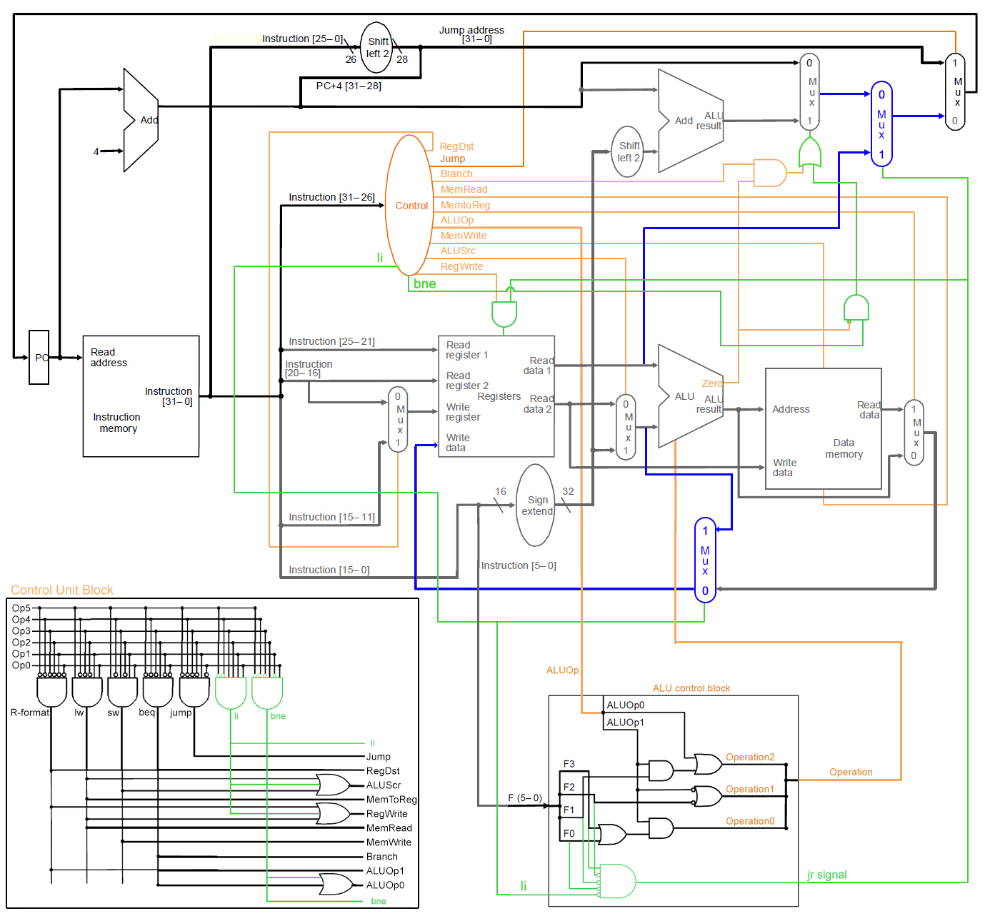

# singlecyle-datapath

## Description

Components created individually, like datapath image below:
- `ALU Control Unit`
- `Arithmetic Logic Unit`
- `Barrel Extensor`
- `Barrel Shifter`
- `Control Unit`
- `Data Memory`
- `Instruction Memory`
- `Multiplexer`
- `Registers Memory`

Other components:
- `Instruction`: Object to facilitate the input of bits in each component
- `BitData`: Extends BitSet class and added extra functions to handle the bits in this project
- `Datapath`: Links all the components like in the image and build the singlecycle datapath

## Usage

Download the latest version on the 'release' tab and run the console with the command below. Or open in some Java IDE and run it.

```
java -jar singlecyle-datapath-1.0.0.jar
```

Use files in the `test` folder as input, or create new ones with 32 bits strings.

Program start in an infinity loop (`while (true)`) and executes all the instructions loaded from file. When an error occurs or instructions end, program throws an exception and stop. Some set of instructions can cause infinity loop, like jump back without exit condition.

[Download](https://github.com/ingoguilherme/singlecyle-datapath/releases/tag/1.0.0)

## Instruction support

- Arithmetic Operations: `add`, `sub`
- Logic Operations: `and`, `or`
- Load/Store: `li`, `lw`, `sw`
- Control Flow: `j`, `jr`, `beq`, `bne`

## TODO

- 

## Datapath image



## Instruction Memory - Console output example

```
Instruction memory - Memory 1
Instruction: 00111100000100010000000000001001 | 32 | Address: 00000000000000000000000000000100 (4)
Instruction: 00111100000100000000000000001000 | 32 | Address: 00000000000000000000000000000000 (0)
Instruction: 00111100000111000000000000110010 | 32 | Address: 00000000000000000000000000001000 (8)
Instruction: 10101111100100000000000000000000 | 32 | Address: 00000000000000000000000000001100 (12)
Instruction: 10101111100100010000000000000100 | 32 | Address: 00000000000000000000000000010000 (16)
Instruction: 10001111100010000000000000000000 | 32 | Address: 00000000000000000000000000010100 (20)
Instruction: 10001111100010010000000000000100 | 32 | Address: 00000000000000000000000000011000 (24)
Instruction: 00000001000010010101000000100000 | 32 | Address: 00000000000000000000000000011100 (28)
Instruction: 00000001000010010111000000100101 | 32 | Address: 00000000000000000000000000101100 (44)
Instruction: 00000001000010010101100000100010 | 32 | Address: 00000000000000000000000000100000 (32)
Instruction: 00000001001010000110000000100010 | 32 | Address: 00000000000000000000000000100100 (36)
Instruction: 00000001000010010110100000100100 | 32 | Address: 00000000000000000000000000101000 (40)
```

## Instruction execution on Datapath - Console output example

Instruction address: `0 0 0 0 0 0 0 0 0 0 0 0 0 0 0 0 0 0 0 0 0 0 0 0 0 0 0 0 0 0 0 0`
Instruction: `li $16,8`

```
Instruction 0
Current PC: 0 0 0 0 0 0 0 0 0 0 0 0 0 0 0 0 0 0 0 0 0 0 0 0 0 0 0 0 0 0 0 0

[ 0| 0| 1| 1| 1| 1| 0| 0| 0| 0| 0| 1| 0| 0| 0| 0| 0| 0| 0| 0| 0| 0| 0| 0| 0| 0| 0| 0| 1| 0| 0| 0] <= Instruction
[31|30|29|28|27|26|25|24|23|22|21|20|19|18|17|16|15|14|13|12|11|10| 9| 8| 7| 6| 5| 4| 3| 2| 1| 0] <= Position
[ OPCODE          |                                                                             ] <= Format not recognized yet

PC+4: 0 0 0 0 0 0 0 0 0 0 0 0 0 0 0 0 0 0 0 0 0 0 0 0 0 0 0 0 0 1 0 0

Control Unit - Control 1:
- opcode: 1 1 1 1 0 0 
- outputs:
  - aluSrc = true
  - regDst = false
  - regWrite = true
  - aluOP1 = false
  - bne = false
  - aluOP0 = false
  - memRead = false
  - li = true
  - memToReg = false
  - branch = false
  - jump = false
  - memWrite = false

Instruction after Control unit:
[ 0| 0| 1| 1| 1| 1| 0| 0| 0| 0| 0| 1| 0| 0| 0| 0| 0| 0| 0| 0| 0| 0| 0| 0| 0| 0| 0| 0| 1| 0| 0| 0] <= Instruction
[31|30|29|28|27|26|25|24|23|22|21|20|19|18|17|16|15|14|13|12|11|10| 9| 8| 7| 6| 5| 4| 3| 2| 1| 0] <= Position
[ OPCODE          | RS           | RT           | CONST/END                                     ] <= I format

Set Registers 'read reg1 address': 0 0 0 0 0
Set Registers 'read reg2 address': 1 0 0 0 0

Multiplexer - regDst writeRegister mux
Signal size: 1
Current signal: 0
Inputs:
 - Signal[0](0) Value[10000]
 - Signal[1](1) Value[00000]
Output: 10000

Setting Registers 'write reg address': 1 0 0 0 0

Barrel Extensor - addr extensor 26->32
Input: 0 0 0 0 0 1 0 0 0 0 0 0 0 0 0 0 0 0 0 0 0 0 1 0 0 0/ Size:26
Extended 32 bit(s)
Output: 0 0 0 0 0 0 0 0 0 0 0 1 0 0 0 0 0 0 0 0 0 0 0 0 0 0 0 0 1 0 0 0/ Size:32

Barrel Shifter - shift left 2 instruction addr
Input: 0 0 0 0 0 0 0 0 0 0 0 1 0 0 0 0 0 0 0 0 0 0 0 0 0 0 0 0 1 0 0 0 / Size: 32
Shift 2 bit(s)
Output: 0 0 0 0 0 0 0 0 0 1 0 0 0 0 0 0 0 0 0 0 0 0 0 0 0 0 1 0 0 0 0 0 / Size: 32

instruction_addr_shifted_extended OR (pc+4' AND 0xF0000000): 0 0 0 0 0 0 0 0 0 1 0 0 0 0 0 0 0 0 0 0 0 0 0 0 0 0 1 0 0 0 0 0/ Size: 32

Barrel Extensor - const extensor 16->32
Input: 0 0 0 0 0 0 0 0 0 0 0 0 1 0 0 0/ Size:16
Extended 32 bit(s)
Output: 0 0 0 0 0 0 0 0 0 0 0 0 0 0 0 0 0 0 0 0 0 0 0 0 0 0 0 0 1 0 0 0/ Size:32

Multiplexer - extensor-register mux
Signal size: 1
Current signal: 1
Inputs:
 - Signal[0](0) Value[00000000000000000000000000000000]
 - Signal[1](1) Value[00000000000000000000000000001000]
Output: 00000000000000000000000000001000

ALU Control Unit - ALU Zero Control
Funct: 0 0 1 0 0 0
Signal: 0 0
Operation: 0 1 0
JR: false

Setting Registers 'writeSignal':true

Arithmetic Logic Unit - ALU Zero
Signal: 0 1 0 Size: 3
Input 1: 0 0 0 0 0 0 0 0 0 0 0 0 0 0 0 0 0 0 0 0 0 0 0 0 0 0 0 0 0 0 0 0
Input 2: 0 0 0 0 0 0 0 0 0 0 0 0 0 0 0 0 0 0 0 0 0 0 0 0 0 0 0 0 1 0 0 0
Zero flag: false
Signal Map: 
 - 0 1 0 = Add
 - 1 1 0 = Sub
 - 0 0 0 = And
 - 0 0 1 = Or

ALU Zero Output: 0 0 0 0 0 0 0 0 0 0 0 0 0 0 0 0 0 0 0 0 0 0 0 0 0 0 0 0 1 0 0 0

Barrel Shifter - shift left 2 extensor output
Input: 0 0 0 0 0 0 0 0 0 0 0 0 0 0 0 0 0 0 0 0 0 0 0 0 0 0 0 0 1 0 0 0 / Size: 32
Shift 2 bit(s)
Output: 0 0 0 0 0 0 0 0 0 0 0 0 0 0 0 0 0 0 0 0 0 0 0 0 0 0 1 0 0 0 0 0 / Size: 32

Arithmetic Logic Unit - ALU PC+4+extensor_output
Signal: 0 1 0 Size: 3
Input 1: 0 0 0 0 0 0 0 0 0 0 0 0 0 0 0 0 0 0 0 0 0 0 0 0 0 0 0 0 0 1 0 0
Input 2: 0 0 0 0 0 0 0 0 0 0 0 0 0 0 0 0 0 0 0 0 0 0 0 0 0 0 1 0 0 0 0 0
Zero flag: false
Signal Map: 
 - 0 1 0 = Add

ALU 'PC+4' + '16->32 Extensor' Output: 0 0 0 0 0 0 0 0 0 0 0 0 0 0 0 0 0 0 0 0 0 0 0 0 0 0 1 0 0 1 0 0

Multiplexer - beq mux
Signal size: 1
Current signal: 0
Inputs:
 - Signal[0](0) Value[00000000000000000000000000000100]
 - Signal[1](1) Value[00000000000000000000000000100100]
Output: 00000000000000000000000000000100

Multiplexer - jr mux
Signal size: 1
Current signal: 0
Inputs:
 - Signal[0](0) Value[00000000000000000000000000000100]
 - Signal[1](1) Value[00000000000000000000000000000000]
Output: 00000000000000000000000000000100

Multiplexer - jump mux
Signal size: 1
Current signal: 0
Inputs:
 - Signal[0](0) Value[00000000000000000000000000000100]
 - Signal[1](1) Value[00000000010000000000000000100000]
Output: 00000000000000000000000000000100

Data memory - Data memory 1
Length: 0
Write Signal: 0
Read Signal: 0
Current address:
 Address[00000000000000000000000000001000](0000000008) Value[empty]
All memory addresses:
 - empty

Multiplexer - alu_zero data_memory mux
Signal size: 1
Current signal: 0
Inputs:
 - Signal[0](0) Value[00000000000000000000000000001000]
 - Signal[1](1) Value[null]
Output: 00000000000000000000000000001000

Multiplexer - li writeData mux
Signal size: 1
Current signal: 1
Inputs:
 - Signal[0](0) Value[00000000000000000000000000001000]
 - Signal[1](1) Value[00000000000000000000000000001000]
Output: 00000000000000000000000000001000

Set registers 'write data': 0 0 0 0 0 0 0 0 0 0 0 0 0 0 0 0 0 0 0 0 0 0 0 0 0 0 0 0 1 0 0 0 / Size:32

Registers: Registers memory
Length: 32
Write Signal: 1
Read register 1: Address[00000](00) Value[00000000000000000000000000000000]
Read register 2: Address[10000](16) Value[00000000000000000000000000001000]
Write register : Address[10000](16) Value[00000000000000000000000000001000]
All registers:
 - Address[01001](09) Value[00000000000000000000000000000000]
 - Address[11001](25) Value[00000000000000000000000000000000]
 - Address[00001](01) Value[00000000000000000000000000000000]
 - Address[10001](17) Value[00000000000000000000000000000000]
 - Address[01101](13) Value[00000000000000000000000000000000]
 - Address[11101](29) Value[00000000000000000000000000000000]
 - Address[00101](05) Value[00000000000000000000000000000000]
 - Address[10101](21) Value[00000000000000000000000000000000]
 - Address[01011](11) Value[00000000000000000000000000000000]
 - Address[11011](27) Value[00000000000000000000000000000000]
 - Address[00011](03) Value[00000000000000000000000000000000]
 - Address[10011](19) Value[00000000000000000000000000000000]
 - Address[01111](15) Value[00000000000000000000000000000000]
 - Address[11111](31) Value[00000000000000000000000000000000]
 - Address[00111](07) Value[00000000000000000000000000000000]
 - Address[10111](23) Value[00000000000000000000000000000000]
 - Address[01000](08) Value[00000000000000000000000000000000]
 - Address[11000](24) Value[00000000000000000000000000000000]
 - Address[00000](00) Value[00000000000000000000000000000000]
 - Address[10000](16) Value[00000000000000000000000000001000]
 - Address[01100](12) Value[00000000000000000000000000000000]
 - Address[11100](28) Value[00000000000000000000000000000000]
 - Address[00100](04) Value[00000000000000000000000000000000]
 - Address[10100](20) Value[00000000000000000000000000000000]
 - Address[01010](10) Value[00000000000000000000000000000000]
 - Address[11010](26) Value[00000000000000000000000000000000]
 - Address[00010](02) Value[00000000000000000000000000000000]
 - Address[10010](18) Value[00000000000000000000000000000000]
 - Address[01110](14) Value[00000000000000000000000000000000]
 - Address[11110](30) Value[00000000000000000000000000000000]
 - Address[00110](06) Value[00000000000000000000000000000000]
 - Address[10110](22) Value[00000000000000000000000000000000]

new pc: 0 0 0 0 0 0 0 0 0 0 0 0 0 0 0 0 0 0 0 0 0 0 0 0 0 0 0 0 0 1 0 0
------------------------------------------
```