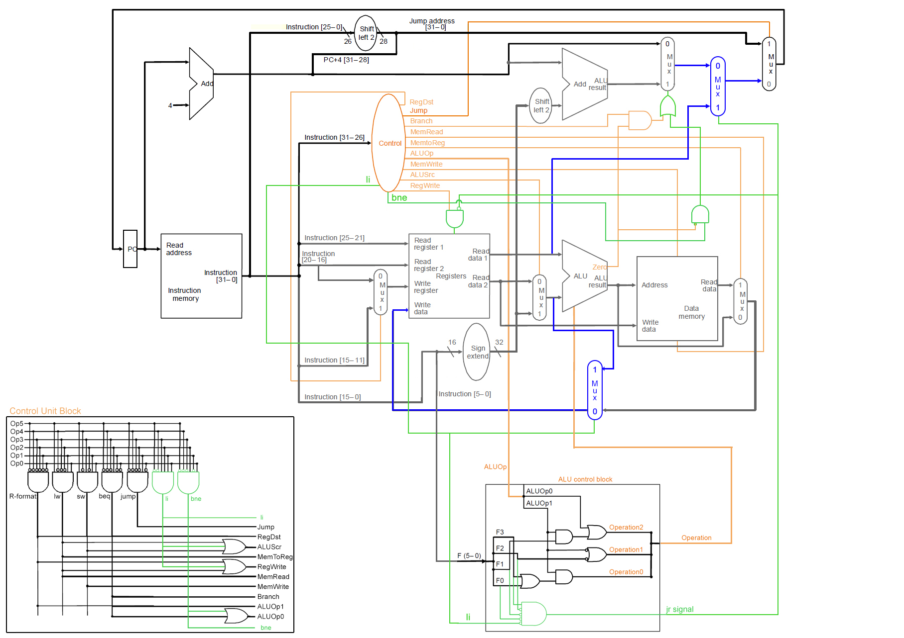

# singlecyle-datapath

## Description

Components created individually, like datapath image below:
- ALU Control Unit
- Arithmetic Logic Unit
- Barrel Extensor
- Barrel Shifter
- Control Unit
- Data Memory
- Instruction Memory
- Multiplexer
- Registers Memory

Other components:
- Instruction: Object to facilitate the input of bits in each component
- BitData: Extends BitSet class and added extra functions to handle the bits in this project
- Datapath: Links all the components like in the image and build the singlecycle datapath

## Usage

Download the latest version on the 'release' tab and run the console with the command below. Or open in some Java IDE and run it.

```
java -jar singlecyle-datapath-1.0.0.jar
```

Use files in the `test` folder as input, or create new ones with 32 bits strings.

Program start in an infinity loop (`while (true)`) and executes all the instructions loaded from file. When an error occurs or instructions end, program throws an exception and stop. Some set of instructions can cause infinity loop, like jump back without exit condition.

## Instruction support

- Arithmetic Operations: `add`, `sub`
- Logic Operations: `and`, `or`
- Load/Store: `li`, `lw`, `sw`
- Control Flow: `j`, `jr`, `beq`, `bne`

## Datapath image

